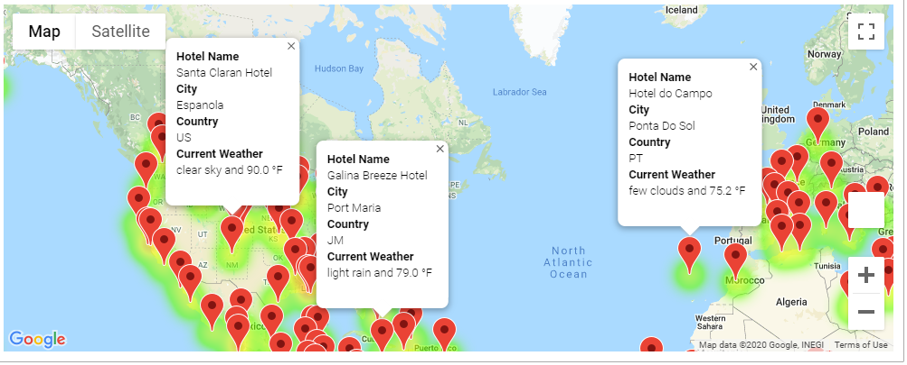
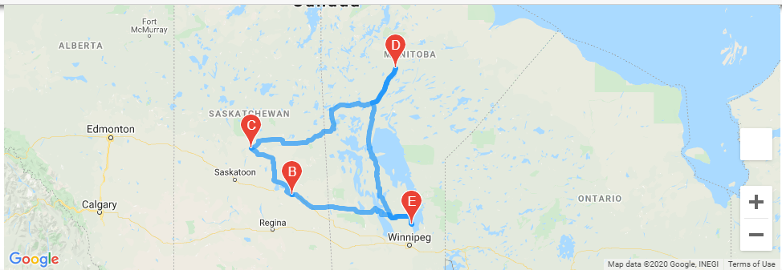
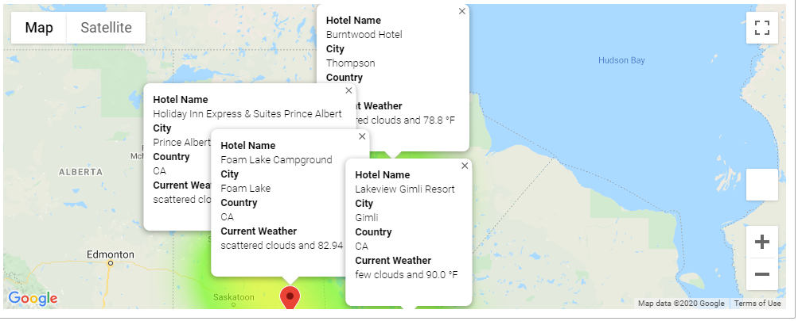

# World_Weather_Analysis
World Weather Analysis to find a good vacation location
 - Module Project
 - Challenge Project
 
## Resources:
 - Data Source: WeatherPy_Database.csv, WeatherPy_vacation.csv
 - Software: anaconda3, python 3.7.7, jupyter notebook
 - Library: matplotlib, matplotlib.pyplots, gmaps, gmaps.datasets, pandas, numpy, citipy, datetime, requests, and scipy
 - APIs: Google Directions, Nearby Search, and open weather map.

## Module Project Overview
During this module project, multiple different API libraries were used, to get a list of cities that are within the temperature parameters user selects and displayed on world map along with heat map layer and city markers. This formed the basis for the challenge project.

## Challenge Overview
As part of this project the following tasks are to be accomplished.

 - A weather database is created that holds around 500 - 700 cities with weather information
 - Select cities out of it based on user temperature preference (min, and max).
 - Create a heat map wtih city markers and a hotel for each city.
 - Select 4 cities user wants to go on vacation and create a route, where start and end are the same city.
 - Show the markers with the 
   - Hotel name
   - City 
   - Country 
   - Current Weather information.
 
 
 
 
 
 
 
 
 
 
